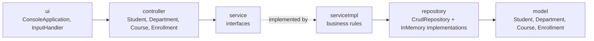
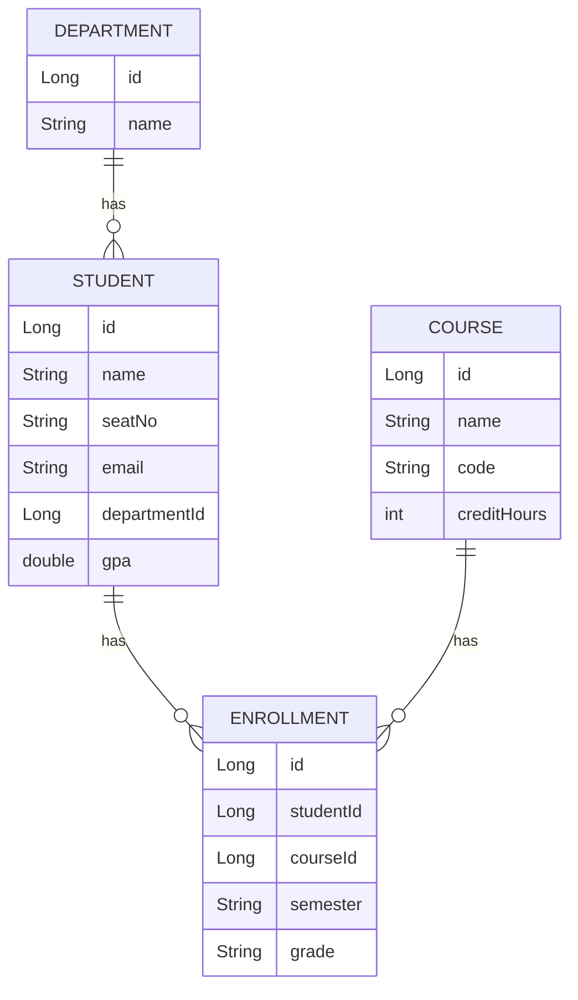

# Student Management Console

A menu-driven **Java 21 console application** for managing students, departments, courses and course enrollments. It is built with a clean, layered architecture (UI → Controller → Service → Repository → Model), centralized validation, and domain-specific exception handling.


---

## Table of Contents

1. [Overview](#1-overview)
2. [Demo](#2-demo)
3. [Key Features](#3-key-features)
4. [Tech Stack](#4-tech-stack)
5. [Architecture](#5-architecture)
6. [Project Structure](#6-project-structure)
7. [Domain Model](#7-domain-model)
8. [Business Rules and Validation](#8-business-rules-and-validation)
9. [Exception Handling](#9-exception-handling)
10. [Getting Started](#10-getting-started)
11. [Usage Guide](#11-usage-guide)
12. [Design Decisions](#12-design-decisions)
13. [Current Limitations](#13-current-limitations)
14. [Author](#15-author)

---

## 1. Overview

Student Management Console lets an administrator register students, organize them into departments, maintain a course catalogue, and record which student is enrolled in which course, semester and grade, all from an interactive terminal menu.

The project is intentionally framework-free. It focuses on core object-oriented design: separation of concerns, interface-based services, a generic repository abstraction, validation inside the domain model, and a consistent error-reporting strategy.

---

## 2. Demo

| Resource | Link |
|----------|------|
| Source Code (GitHub) | https://github.com/hassansherwani2610/student-management-console |
| Source Code (GitLab) | https://gitlab.com/HassanS10/student-management-console |

<!-- Replace "Coming soon" with the real links when available, e.g.:
[](https://www.youtube.com/watch?v=VIDEO_ID)
-->

### Sample Session

```text
============== MAIN MENU ==============
  Total Students: 0  |  Total Departments: 5  |  Total Courses: 4  |  Total Enrollments: 0
  1. Students
  2. Departments
  3. Courses
  4. Enrollments
  0. Exit
=======================================

Next step: open Students -> Register a new student.
Choose an option:
```

---

## 3. Key Features

**Students**
- Register, view, find, update and delete students
- Update a single field (name, email, department, GPA, seat number) or the whole record
- Search by name, filter by department, filter by GPA range
- Sort by name, GPA (highest first) or ID
- Automatic academic standing derived from GPA (`Excellent`, `Good`, `Satisfactory`, `At Risk`)

**Departments**
- Add, view, rename and delete departments

**Courses**
- Add, view, update and delete courses (name, code, credit hours)

**Enrollments**
- Enroll a student in a course for a given semester with a grade
- View, update and delete enrollments

**User experience**
- Numbered pick-lists for students, courses, departments and enrollments (no manual ID typing)
- Inline "add new" option inside pick-lists where it makes sense
- Auto-generated IDs
- Sample departments and courses pre-loaded on first run
- Live record counts and a contextual "Next step" hint on the main menu
- Press **Enter on an empty prompt** at any question to cancel and go back
- "Re-enter the details?" recovery on validation or duplicate errors

---

## 4. Tech Stack

### Used in this project

| Area | Technology |
|------|------------|
| Language | Java 21 |
| Build tool | Gradle 8.4 (Gradle Wrapper, Kotlin DSL) |
| Runtime dependencies | None (pure JDK) |
| Version control | Git, GitHub and GitLab (dual remotes) |
| IDE | IntelliJ IDEA |

### Concepts applied

Layered architecture, interface-based design, generic repository pattern, manual dependency injection (constructor injection), domain-driven validation, custom unchecked exceptions, Java Streams and Text Blocks.

---

## 5. Architecture



| Layer | Package | Responsibility |
|-------|---------|----------------|
| Presentation | `org.example.ui` | Menus, prompts, formatted output, error display. `InputHandler` wraps `Scanner` and handles cancel-on-empty input. |
| Controller | `org.example.controller` | Thin pass-through between the UI and the services. `ConsoleController` is the composition root that wires every repository, service and controller by hand. |
| Service (contract) | `org.example.service` | Interfaces describing each entity's operations. |
| Service (logic) | `org.example.serviceImpl` | Business rules: uniqueness checks, referential integrity, existence checks, sorting and filtering. |
| Repository | `org.example.repository` | Generic `CrudRepository<T, ID>` and four in-memory implementations backed by `LinkedHashMap`. |
| Model | `org.example.model` | Entities that validate themselves in constructors and setters. |
| Exception | `org.example.exception` | Domain-specific unchecked exceptions grouped by entity. |

**Wiring** (in `ConsoleController`):

- `DepartmentServiceImpl` uses the department and student repositories
- `CourseServiceImpl` uses the course and enrollment repositories
- `StudentServiceImpl` uses the student and enrollment repositories and `DepartmentService`
- `EnrollmentServiceImpl` uses the enrollment repository, `StudentService` and `CourseService`

---

## 6. Project Structure

```text
student-management-console/
├── build.gradle.kts                  # Gradle build script (Java 21 toolchain, jar manifest)
├── settings.gradle.kts               # Root project name
├── gradlew / gradlew.bat             # Gradle Wrapper scripts (Unix / Windows)
├── gradle/
│   └── wrapper/
│       ├── gradle-wrapper.jar
│       └── gradle-wrapper.properties # Gradle 8.4 distribution
├── jar/
│   └── student-management-console.jar   # Pre-built runnable jar
├── .gitignore
└── src/
    └── main/
        └── java/
            └── org/
                └── example/
                    ├── Main.java                         # Entry point
                    ├── controller/
                    │   ├── ConsoleController.java        # Composition root (manual wiring)
                    │   ├── StudentController.java
                    │   ├── DepartmentController.java
                    │   ├── CourseController.java
                    │   └── EnrollmentController.java
                    ├── exception/
                    │   ├── common/
                    │   │   ├── ValidationException.java
                    │   │   ├── EntityInUseException.java
                    │   │   └── OperationCancelledException.java
                    │   ├── student/
                    │   │   ├── StudentNotFoundException.java
                    │   │   └── DuplicateStudentException.java
                    │   ├── department/
                    │   │   ├── DepartmentNotFoundException.java
                    │   │   └── DuplicateDepartmentException.java
                    │   ├── course/
                    │   │   ├── CourseNotFoundException.java
                    │   │   └── DuplicateCourseException.java
                    │   └── enrollment/
                    │       ├── EnrollmentNotFoundException.java
                    │       └── DuplicateEnrollmentException.java
                    ├── model/
                    │   ├── Student.java
                    │   ├── Department.java
                    │   ├── Course.java
                    │   └── Enrollment.java
                    ├── repository/
                    │   ├── CrudRepository.java           # Generic CRUD contract
                    │   ├── InMemoryStudentRepository.java
                    │   ├── InMemoryDepartmentRepository.java
                    │   ├── InMemoryCourseRepository.java
                    │   └── InMemoryEnrollmentRepository.java
                    ├── service/
                    │   ├── StudentService.java
                    │   ├── DepartmentService.java
                    │   ├── CourseService.java
                    │   └── EnrollmentService.java
                    ├── serviceImpl/
                    │   ├── StudentServiceImpl.java
                    │   ├── DepartmentServiceImpl.java
                    │   ├── CourseServiceImpl.java
                    │   └── EnrollmentServiceImpl.java
                    └── ui/
                        ├── ConsoleApplication.java       # Menus and user flows
                        └── InputHandler.java             # Console input helper
```

> `build/`, `.gradle/` and `.idea/` are generated locally and excluded from version control.

---

## 7. Domain Model



A **Student** belongs to one **Department**. Students and **Courses** have a many-to-many relationship through **Enrollment**, which also stores the semester and grade.

**Pre-loaded sample data (first run only)**

| Departments | Courses |
|-------------|---------|
| Computer Science | CS101 - Programming Fundamentals (3 credits) |
| Software Engineering | CS201 - Data Structures (3 credits) |
| Electrical Engineering | CS301 - Database Systems (3 credits) |
| Business Administration | MT101 - Calculus I (3 credits) |
| Mathematics | |

---

## 8. Business Rules and Validation

Validation lives inside the model classes, so an invalid object can never be created or left half-updated. Uniqueness and referential rules are enforced in the service layer.

### Field validation

| Entity | Rules |
|--------|-------|
| All entities | ID must be greater than zero (IDs are immutable) |
| Student | Name and seat number required (trimmed). Email required, trimmed, lower-cased and matched against an email pattern. Department required. GPA between **0.0 and 4.0** (NaN and infinity rejected). |
| Department | Name required (trimmed) |
| Course | Name required. Code required (trimmed, converted to upper case). Credit hours greater than zero. |
| Enrollment | Student ID and course ID greater than zero. Semester required (trimmed). Grade required and one of **A, B, C, D, F** (case-insensitive, stored upper case). |

### Uniqueness rules

| Entity | Must be unique |
|--------|----------------|
| Student | Email and seat number (case-insensitive) |
| Department | Name (case-insensitive) |
| Course | Course code (case-insensitive) |
| Enrollment | Combination of student + course + semester |

### Referential integrity

- A student can only be created or moved into an **existing** department
- An enrollment can only reference an **existing** student and course
- A department that still has students **cannot be deleted**
- A student or course that still has enrollments **cannot be deleted**

### Academic standing

| GPA | Standing |
|-----|----------|
| 3.5 and above | Excellent |
| 3.0 to below 3.5 | Good |
| 2.0 to below 3.0 | Satisfactory |
| Below 2.0 | At Risk |

---

## 9. Exception Handling

All exceptions are unchecked (`RuntimeException`) and grouped by domain. The UI translates them into friendly messages in a single place (`ConsoleApplication.reportError`), and each menu action is wrapped so an error never crashes the application.

| Exception | Package | Meaning | Message shown to the user |
|-----------|---------|---------|---------------------------|
| `ValidationException` | `exception.common` | Invalid field value | `Error: ...` |
| `EntityInUseException` | `exception.common` | Delete blocked by related records | `Cannot delete: ...` plus a tip |
| `OperationCancelledException` | `exception.common` | User pressed Enter on an empty prompt | `Cancelled.` |
| `StudentNotFoundException`, `DuplicateStudentException` | `exception.student` | Missing or duplicate student | `Error: ...` |
| `DepartmentNotFoundException`, `DuplicateDepartmentException` | `exception.department` | Missing or duplicate department | `Error: ...` |
| `CourseNotFoundException`, `DuplicateCourseException` | `exception.course` | Missing or duplicate course | `Error: ...` |
| `EnrollmentNotFoundException`, `DuplicateEnrollmentException` | `exception.enrollment` | Missing or duplicate enrollment | `Error: ...` |
| Any other `RuntimeException` | - | Unexpected failure | `Unexpected error: ...` |

---

## 10. Getting Started

### Prerequisites

- **JDK 21** (the Gradle toolchain is configured for Java 21)
- Git
- No separate Gradle installation is needed; the Gradle Wrapper is included

### Clone the repository

```bash
# GitHub
git clone git@github.com:hassansherwani2610/student-management-console.git

# or GitLab
git clone git@gitlab.com:HassanS10/student-management-console.git

cd student-management-console
```

### Option A: Run the pre-built jar

```bash
java -jar jar/student-management-console.jar
```

### Option B: Build from source

**Windows (PowerShell / CMD)**

```powershell
.\gradlew.bat build
java -jar build\libs\student-management-console-1.0-SNAPSHOT.jar
```

**macOS / Linux**

```bash
chmod +x gradlew
./gradlew build
java -jar build/libs/student-management-console-1.0-SNAPSHOT.jar
```

### Run from IntelliJ IDEA

1. Open the project folder (IntelliJ imports it as a Gradle project)
2. Set the Project SDK to JDK 21
3. Run `org.example.Main`

---

## 11. Usage Guide

1. Start the application. Sample departments and courses are already loaded.
2. Follow the **Next step** hint on the main menu. A good first path is **Students → Register a new student**.
3. Type the number of an option and press **Enter**.
4. When choosing a student, course, department or enrollment, pick it from the numbered list. Use the `0. + Add ...` entry to create a new one on the spot where offered.
5. Press **Enter on an empty line** at any prompt to cancel the current action.
6. Choose **0** in the main menu to exit.

**Typical workflow**

```text
Register student  →  (department picked from list)  →  Enroll student in course  →  View enrollments
```

---

## 12. Design Decisions

| Decision | Reason |
|----------|--------|
| Generic `CrudRepository<T, ID>` | One contract for all entities; storage can be swapped without touching services. |
| Interfaces in `service`, logic in `serviceImpl` | Programming to abstractions keeps layers loosely coupled and easy to test. |
| Validation inside the model | Objects are always in a valid state, whichever layer creates them. |
| Rebuild-and-validate on full updates | A failed update never leaves a record partially modified. |
| Domain-grouped exception packages | Clear ownership and easier navigation as the project grows. |
| Single `reportError` handler | Consistent user-facing messages and no duplicated try/catch logic. |
| Manual constructor injection in `ConsoleController` | Explicit wiring with no framework, and simple to migrate to a DI container later. |
| Auto-generated IDs and pick-lists | Removes typing errors and makes the app faster to use. |

---

## 13. Current Limitations

- **Data is stored in memory only** and is lost when the application exits
- Single-user, terminal-only interface

---

## 14. Author

**Hassan Sherwani**
Java Intern at Centegy Technologies | Backend-focused Software Engineer, Karachi, Pakistan

- GitHub: [hassansherwani2610](https://github.com/hassansherwani2610)
- GitLab: [HassanS10](https://gitlab.com/HassanS10)
- Portfolio / Website: [Hassan Sherwani Portfolio](https://hassan-sherwani-portfolio.vercel.app/)
- LinkedIn: _Add your profile link_ [Hassan Sherwani](https://www.linkedin.com/in/hassan-sherwani-9949b82b5/?isSelfProfile=true)

**Core skills:** Java, Spring Boot, Microservices, Apache Kafka, React JS, SQL (MySQL, PostgreSQL), Docker, Kong API Gateway, Prometheus, Grafana

---

_Built as a learning-focused project to strengthen Java, object-oriented programming, clean architecture, and backend development skills._
